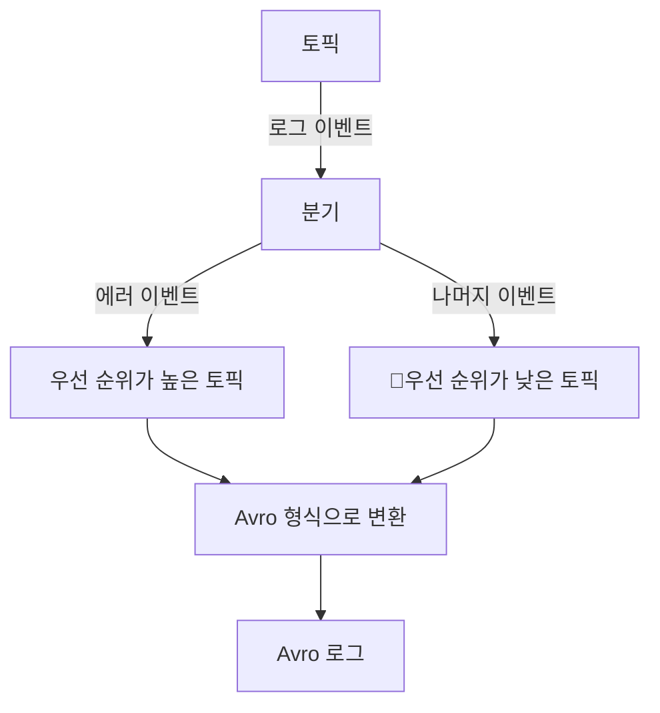
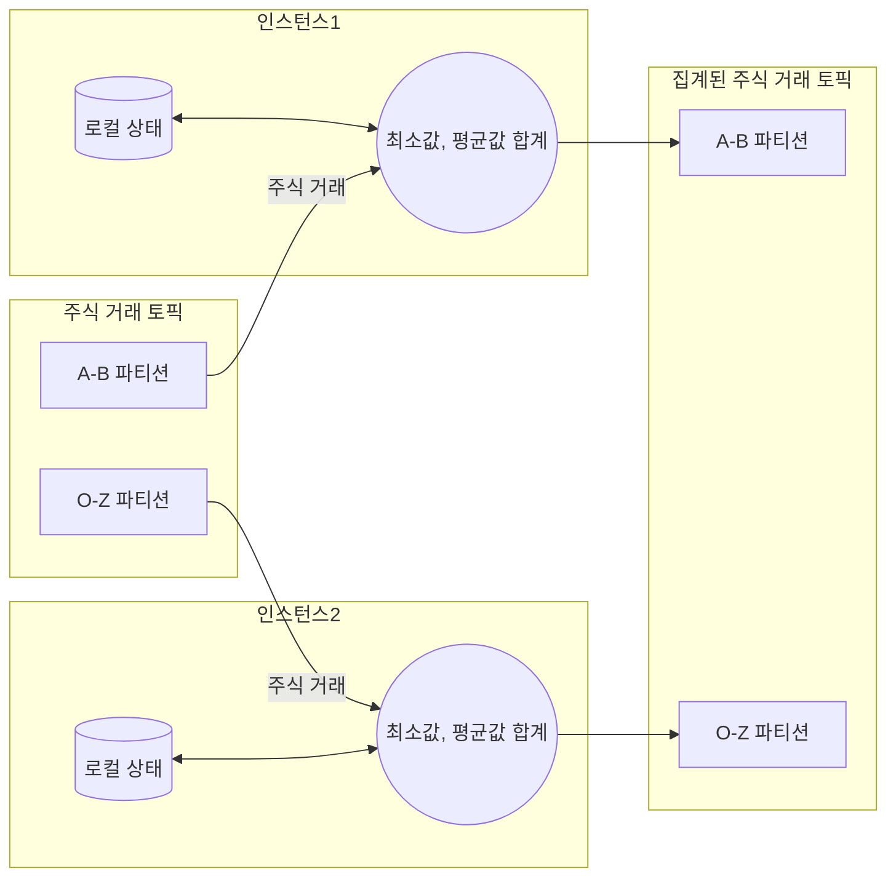
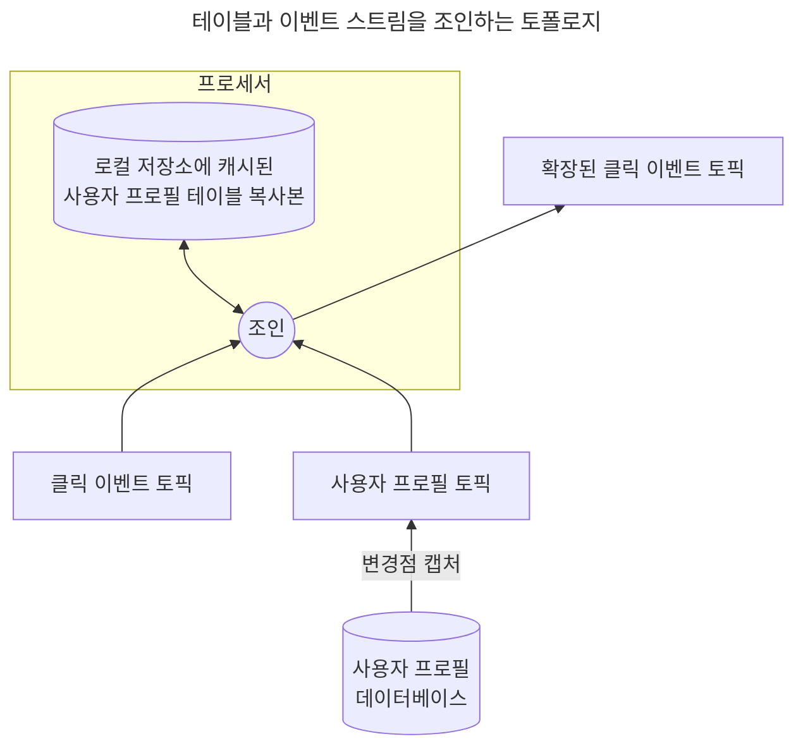

Chapter14. 스트림 처리
---

# 시작하며
- 카프카는 전통적으로 강력한 메시지 버스로 사용되어 왔으며, 많은 스트림 처리 시스템들이 카프카를 데이터 저장소로 활용했다.
- 카프카의 활용은 단순한 메시지 버스를 넘어 데이터 통합 시스템으로 발전했다.
- 버전 0.10.0부터는 **카프카 스트림즈** 또는 Stream API라 불리는 스트림 처리 라이브러리를 클라이언트 라이브러리의 일부로 포함하여 외부 처리 프레임워크에 의존하지 않고 애플리케이션 내에서 이벤트를 직접 읽고 처리할 수 있게 되었다.

# 스트림 처리란 무엇인가?
- **스트림 처리**는 **데이터 스트림**(이벤트 스트림, 스트리밍 데이터)을 처리하는 것
	- 하나 이상의 **이벤트 스트림**을 계속해서 처리하는 것
- **데이터 스트림**은 **무한히** 늘어나는 **데이터세트**를 의미
- 시간이 지남에 따라 끊임없이 새로운 레코드가 추가되기 때문에 데이터세트가 '무한'해지는 것
- 이벤트 스트림이라는 개념은 신용카드 결제, 주식 거래, 택배 배송 등 다양한 비즈니스 활동에서 찾아볼 수 있으며, 스트림 처리 분야는 여전히 발전 중이다.

### 이벤트 스트림의 특성
1. 이벤트는 그 자체로 다른 이벤트 전, 후에 발생했다는 의미를 갖는다.
2. 데이터는 한 번 발생한 뒤에는 절대 고칠 수 없다.
3. 이벤트 스트림을 캡처하고 또 재생(replay)할 수 있다. 

### 스트림 처리와 다른 패러다임들
1. 요청-응답
	- 응답 시간이 1 밀리 ~ 몇 밀리 초 수준인, 가장 지연이 적은 패러다임
	- 애플리케이션이 요청을 보낸 뒤 처리 시스템이 응답을 할 때까지 기다리는 게 보통이다.
2. 배치 처리
3. 스트림 처리
	- 연속적이고 논블록킹하게 작동하는 방식
	- 무한한 크기의 데이터 세트에서 연속적으로 데이터를 읽어와서, 뭔가를 하고 결과를 내보내는 한 우리는 스트림 처리를 수행하고 있는 것이다.

## 스트림 처리 개념
- 스트림 처리는 기본적으로 데이터를 읽고, 이를 변환하거나 집계 처리하는 등의 작업을 수행한 후 결과물을 어딘가에 저장하는 과정
- 이 과정은 일반적인 데이터 처리와 유사하지만, 스트림 처리만의 고유한 특징들이 있다.

### 토폴로지
- 스트림 처리 애플리케이션은 하나 이상의 '처리 토폴로지'를 포함한다.
- 이 토폴로지는 하나 이상의 소스 스트림에서 시작하여, 여러 스트림 프로세서를 거쳐가며 데이터를 처리하고, 최종적으로 하나 이상의 싱크 스트림에 결과를 전달하는 구조를 가진다.
- 스트림 프로세서는 데이터 스트림에 적용되는 다양한 연산 단계(예: filter, count, group by, leftj join조인 등)를 나타낸다.

### 시간
스트림 처리 시스템은 다음과 같은 시간 개념을 사용한다.

1. **이벤트 시간 (Event Time)**
	- 이벤트 시간은 해당 이벤트가 실제로 발생한 시점을 의미
	- 예를 들면, 상품이 팔린 시각, 웹 페이지가 조회된 시각 등이 이에 해당
	- 카프카는 0.10.0 버전 이후부터 프로듀서가 레코드를 생성할 때 기본적으로 현재 시각을 추가한다.
	- 이 시간은 스트림 데이터를 처리할 때 가장 중요한 시간으로 간주된다.
    
2. **로그 추가 시간 (Log Append Time)**
	- 로그 추가 시간은 이벤트가 카프카 브로커에 전달되어 저장되는 시점
	- 이 시간은 일반적으로 이벤트 시간보다는 덜 중요하지만, 레코드가 생성된 후에는 변경되지 않기 때문에 이벤트 시간이 기록되지 않은 경우에는 이벤트 시간의 근사값으로 사용될 수 있다.
    
3. **처리 시간 (Processing Time)**
	- 처리 시간은 스트림 처리 애플리케이션이 이벤트를 실제로 받아 처리하기 시작하는 시간
	- 이것은 이벤트 발생 후 짧은 시간 내일 수도 있고,몇 밀리초, 몇 시간, 심지어 며칠 뒤일 수도있다.
	- 이 개념은 정확히 언제 스트림 처리 애플리케이션이 이벤트를 읽었느냐에 따라서 전혀 다른 타임스탬프가 주어지기 때문에 신뢰성이 떨어지며, 가능한 한 피하는 것이 좋다.

### 상태
1. **로컬 혹은 내부 상태**
	- 스트림 처리 애플리케이션의 특정 인스턴스 내에서만 사용되는 상태를 의미
	- 장점: 이 상태는 보통 내장형 인메모리 데이터베이스를 사용하여 관리되며, 처리 속도가 매우 빠르다.
	- 단점: 메모리 크기의 제한이 있으며, 애플리케이션이 정지하거나 크래시 날 경우 상태가 유실될 위험이  있다.
		- 스트림 처리의 많은 디자인 패턴들은 데이터를 분할해서 한정된 크기의 로컬 상태를 사용해서 처리 가능한 서브스트림(substream)으로 만드는 데 초점을 둔다.
    
2. **외부 상태**
	- 외부 데이터 저장소에 유지되는 상태로, 주로 NoSQL 시스템과 같은 외부 저장소를 활용
	- 장점: 크기에 거의 제한이 없고 여러 애플리케이션 인스턴스 또는 다른 애플리케이션에서도 접근할 수 있다.
	- 단점: 추가적인 시스템 도입으로 인한 지연 증가, 복잡도 증가, 가용성 문제를 야기할 수 있다. 
		- 많은 스트림 처리 애플리케이션은 이러한 문제를 방지하기 위해 외부 상태를 로컬 상태에 캐싱하거나 외부 저장소와의 통신을 최소화하는 방법을 사용

### 스트림-테이블 이원성 (Stream - Table Duality, 두 개의 서로 다른 근본 원리가 갖는 성질)

#### 테이블
- 테이블은 Query함으로써 **특정 한 시점**에서의 데이터 상태를 확인할 수 있다.
- 테이블을 스트림으로 변환하기 위해서 테이블의 변경 내역을 잡아내야 한다.

#### 스트림
- 스트림은 변경을 유발하는 이벤트의 **연속적인** 내역을 저장한다. 
- 스트림을 테이블로 변환하기 위해서 모든 변경 사항을 처음부터 끝까지 테이블에 적용해야 한다. (Materialize)

### 시간 윈도우
스트림 작업은 시간을 윈도우라 불리는 구간 단위로 잘라서 처리한다.
1. **윈도우 크기**: 
	- 윈도우 크기는 분석하고자 하는 시간 범위를 결정 (예: 5분, 15분, 혹은 하루 단위)
	- 윈도우 크기가 커질수록 평균은 완만해지지만, 지연(lag) 역시 증가
	- 카프카 스트림은 활동이 없는 기간에 따라 윈도우 크기를 조정하는 '세션 윈도우'도 지원하며, 이는 개발자가 정의한 세션 간격에 따라 연속적으로 도착하는 이벤트들을 하나의 세션으로 그룹화
    
2. **시간 윈도우의 진행 간격**
	- 윈도우의 업데이트 주기를 결정
	- 예를 들어, 5분 단위 평균은 매분, 매초, 또는 새로운 이벤트가 도착할 때마다 업데이트될 수 있다.
	- 윈도우 크기와 진행 간격이 같은 경우 '텀블링 윈도우' (또는 슬라이딩 윈도우)
		- 예) 5분마다 이동하는 5분 길이의 윈도우
	- 간격이 다른 경우 '호핑 윈도우'
		- 예) 1분마다 이동하는 5분 길이 윈도우
    
3. **윈도우를 업데이트할 수 있는 시간 (Grace Period)**
	- 과거 윈도우에 대한 데이터 업데이트 가능 여부를 결정
	- 예를 들어, 오전 00:00부터 00:05까지의 5분 이동 평균을 계산한 후 한 시간 뒤에 추가로 이벤트 데이터가 도착하면, 이를 업데이트할지 여부를 결정해야 한다.
    

이와 함께, 윈도우는 실제 시간(Clock Time)에 맞춰 정렬되거나, 애플리케이션이 실행된 시점을 기준으로 설정될 수 있다. 

### 처리 보장
- '정확히 한 번' 보장이 없는 경우 스트림 처리는 정학환 결과가 요구되는 상황에서 사용될 수 없다.
- 카프카 스트림즈 라이브러리를 사용하는 애플리케이션은 `processing.guarantee` 설정을 `exactly_once`로 설정해서 정확히 한 번 보장 기능을 활성화 할 수 있다.

# 스트림 처리 디자인 패턴

### 단일 이벤트 처리

- 개별 이벤트를 독립적으로 처리하는 가장 기본적인 스트림 처리 패턴
- 맵/필터 패턴으로 알려져 있으며, 이벤트를 걸러내거나 변환하는 데 사용
- 예를 들어, 로그 메시지를 읽어서 ERROR 이벤트를 우선순위가 높은 스트림에, 나머지 이벤트를 우선순위가 낮은 스트림에 쓰는 것 등이 해당
- 각 이벤트가 독립적으로 처리되기 때문에 애플리케이션 내 상태 유지가 필요 없고, 장애 복구나 부하 분산이 용이하다.

### 로컬 상태와 스트림 처리

- 주식 최저가와 최고가 찾기, 이동 평균 구하기와 같이 정보 집계에 초점을 맞춘 애플리케이션에서 활용
- 이러한 집계를 위해서는 스트림의 상태(state)를 유지할 필요가 있다.
- 예시
	- 로컬 상태는 애플리케이션 인스턴스 내에 유지되며, 주식 종목별로 분류하여 처리한다.
	- 카프카 파티셔너를 사용하여 동일한 주식의 모든 이벤트가 같은 파티션에 쓰여지도록 하며, 각 인스턴스는 할당된 파티션의 상태를 유지한다.

#### 메모리 사용
- 로컬 상태는 메모리 내에서 유지되는 것이 이상적
- 디스크에 저장하는 로컬 저장소의 경우, 성능에 영향을 미칠 수 있다.

#### 영속성
- 애플리케이션 인스턴스가 종료되었을 때 상태의 유실 없이, 재실행이나 다른 인스턴스로의 대체 시 상태 복구가 가능해야 한다.
- 카프카 스트림즈는 내장된 RocksDB를 사용함으로써 로컬 상태를 인메모리 방식으로 저장하고, 디스크에 데이터를 영속적으로 저장하여 재시작 시 빠른 복구가 가능하다.
- 모든 변경 사항은 카프카 토픽에도 보내져서 해당 스트림 처리를 담당하는 노드에 장애가 발생해도 로컬 상태가 유실되지 않는다. (토픽으로부터 이벤트를 읽어옴으로써 쉽게 복구될 수 있기 때문)

#### 리밸런싱
- 파티션의 재할당 시, 상실한 애플리케이션 인스턴스는 마지막 상태를 저장하여 새로운 인스턴스가 이전 상태를 복구할 수 있도록 해야 한다.

### 다단계 처리/리파티셔닝

- 그룹별 집계에 로컬 상태 사용이 적합하지만, 모든 정보를 사용하여 결과를 내야 하는 경우에는 다단계 처리가 필요하다.
- 예시
	- 하루 동안 가장 많이 오른 상위 10개 주식을 계산하는 경우, 이 정보는 여러 인스턴스에 분산될 수 있어 단일 인스턴스로는 충분하지 않다.
	- 1단계: 각 주식별로 하루 동안의 상승하락을 각 애플리케이션 인스턴스에서 로컬 상태를 사용하여 계산 (위와 같음, [[카프카 핵심 가이드 스터디 - 스트림 처리#로컬 상태와 스트림 처리]])
	- 2단계: 이 결과를 하나의 파티션만 가진 새로운 토픽에 쓰고, 이를 하나의 애플리케이션 인스턴스가 읽어 매일 상위 10개 주식을 찾는다.
	- 이와 같은 다단계 처리는 맵리듀스 코드 작성에 익숙한 사람들에게는 친숙한 방식이며, 대부분의 스트림 처리 프레임워크는 모든 단계를 하나의 애플리케이션 내에서 처리할 수 있도록 지원한다.

### 외부 검색을 사용하는 처리: 스트림-테이블 조인

- 스트림 처리 시 종종 외부 데이터와의 조인이 필요하다. 
- 예시:
	- 사용자 클릭 내역을 사용자 정보와 결합하는 경우
	- 간단한 방법은 클릭 이벤트가 발생할 때마다 사용자 정보를 프로필 데이터베이스에서 조회해 클릭 이벤트에 추가하는 것
	- 하지만 이 방법에서 데이터베이스는 스트림 처리보다 느리고, 가용성을 보장하기 위해 수반되는 복잡성도 문제가 될 수 있다.
	- 성능과 가용성을 모두 고려하기 위해서는 **스트림 처리 애플리케이션 내에 데이터베이스 데이터를 캐시**하는 것이 필요
	- 하지만 캐시 정보의 만료와 최신으로 유지하기 위한 관리가 중요하다.
		- 데이터베이스의 모든 변경을 이벤트 스트림으로 받아와서 캐시를 업데이트 하는 방법
		- 이를 **CDC(Change Data Capture)** 라 하며, 카프카 커넥트를 통해 데이터베이스 테이블의 변경 이벤트를 스트림으로 변환할 수 있다.
		- 데이터베이스 변경 이벤트가 발생할 때마다 테이블의 복사본을 따로 로컬에 유지할 수 있다.

### 테이블-테이블 조인

- 이전에 테이블과 변경 이벤트 스트림의 동등성에 대해 배웠고, 스트림과 테이블 조인의 작동 방식을 살펴보았다.
- 두 개의 테이블을 조인하는 것은 윈도우 처리되지 않는 연산으로, 실행 시점에 양 테이블의 현재 상태를 조인한다.
- 카프카 스트림에서는 동일한 방식으로 파티션된 동일한 키를 가진 두 개의 테이블에 대해 동등 조인(equi-join)을 수행할 수 있다. 이를 통해 조인 연산이 여러 애플리케이션 인스턴스와 장비에 효율적으로 분산된다.
- 카프카 스트림즈는 또한 두 개의 테이블에 대한 외래 키(foreign key) 조인도 지원한다. 이는 한 스트림 혹은 테이블의 키와 다른 스트림 혹은 테이블의 임의의 필드를 조인할 수 있게 한다.

### 스트리밍 조인 (또는 윈도우 조인)

- 때때로 두 개의 실제 이벤트 스트림을 조인할 필요가 있다.
- 스트림은 무한이라는 특징을 가지고 있다. 스트림과 테이블을 조인할 때 대부분의 과거 이벤트는 무시할 수 있지만, 두 스트림을 조인할 경우 과거와 현재의 모든 이벤트를 고려해야 한다.
- 이러한 스트리밍 조인은 윈도우 조인이라고 한다.
- 예시
	- 사용자들의 검색 쿼리 스트림과 검색 결과 클릭 내역 스트림을 조인하는 경우, 특정한 시간 윈도우 안에서만 맞추어야 한다.
	- 이 경우, 어느 검색 쿼리가 들어온 지 몇 초 후에 클릭된 결과를 맞춰야 하므로, 각 스트림에 대해 몇 초 길이의 윈도우를 유지하며 이벤트를 맞춰줘야 한다.
- 카프카 스트림즈는 조인된 두 스트림이 동일하게 조인 키에 대해 파티셔닝되어 있을 때 동등 조인을 지원한다.

### 비순차 이벤트

- 스트림 처리에서 비순차 이벤트의 처리는 어려운 일이다.
- 예시
	- WiFi 신호가 끊긴 모바일 장치가 재접속할 때 몇 시간치의 이벤트를 한꺼번에 전송하는 경우
- 스트림 애플리케이션은 다음과 같은 일들을 해야 한다.
    - 이벤트가 순서를 벗어났음을 알아차리고, 이벤트 시간을 확인하여 현재 시각보다 이전인지 확인해야 한다.
    - 비순차 이벤트의 순서를 복구할 수 있는 시간 영역을 정의해야 한다. 예를 들어, 3시간 이내의 이벤트는 복구하고, 3주 이상 오래된 이벤트는 포기하는 식이다.
    - 순서를 복구하기 위해 이벤트를 묶어야 하며, 스트리밍 애플리케이션은 주어진 시점 기준으로 오래된 이벤트와 새로운 이벤트를 모두 처리해야 한다.
    - 결과를 변경할 수 있어야 한다. 예를 들어, 데이터베이스에 쓰여진 결과를 변경하거나, 이메일로 전송된 결과의 변경이 필요할 수 있다.
- 구글의 데이터플로(Dataflow)나 카프카 스트림 같은 스트림 처리 프레임워크는 처리 시간과 독립적인 이벤트 시간을 지원하며, 현재 처리 시간 이전 혹은 이후의 이벤트 시간을 가진 이벤트를 다룰 수 있다.
- 이는 로컬 상태에 여러 집계 윈도우를 변경 가능한 형태로 유지하고, 개발자가 이 윈도우를 얼마나 오랫동안 유지할지 설정할 수 있게 해준다.
- 카프카 스트림즈 API는 집계 결과를 결과 토픽에 쓰며, 이 토픽들은 로그 압착이 설정되어 있어 각 키값에 대해 마지막 밸류값만 유지된다. 늦게 도착한 이벤트로 인해 집계 윈도우의 결과가 변경되어야 할 경우, 카프카 스트림즈는 해당 집계 윈도우의 새로운 결과값을 써서 기존 결과값을 대체한다.

### 재처리하기

- 이벤트 재처리에는 두 가지 변형이 있다.
    1. **새로운 스트림 처리 애플리케이션 버전**
	    - 기존 이벤트 스트림을 새 버전 애플리케이션에서 재처리하여 새로운 결과 스트림을 생성합한다. 이때 구버전의 결과를 바로 교체하지 않고, 두 버전의 결과를 비교한 뒤 적절한 시점에 신버전의 결과를 사용한다.
    2. **기존 스트림 처리 애플리케이션의 버그 수정**
	    - 버그가 수정된 후 이벤트 스트림을 재처리하여 결과를 다시 산출한다.
	    
- 첫 번째 사례는 카프카를 사용하여 간단히 해결할 수 있다. 카프카는 데이터 저장소에 이벤트 스트림을 오랫동안 저장하므로, 신버전 애플리케이션을 새 컨슈머 그룹으로 실행시키고 입력 토픽의 첫 번째 오프셋부터 처리를 시작하여 두 결과 스트림을 생성할 수 있다.
- 두 번째 경우는 더 어렵다. 기존 애플리케이션을 초기화하여 입력 스트림의 처음부터 다시 처리하고, 로컬 상태와 기존 출력 스트림의 내용을 초기화해야 할 수도 있다. 하지만 이 경우 첫 번째 방식을 사용하는 것이 더 안전하고 권장된다.

### 인터랙티브 쿼리

- 스트림 처리 애플리케이션은 상태를 보유하며, 이 상태는 애플리케이션의 여러 인스턴스 사이에 분산될 수 있다.
- 일반적으로 사용자는 결과 토픽을 통해 처리 결과를 받아볼 수 있지만, 때때로 상태 저장소에서 직접 결과를 읽어올 필요가 있다. 이는 특히 처리 결과가 테이블 형태인 경우에 흔하다. 
	- 예시: 가장 많이 팔린 도서 10종의 경우, 결과 스트림이 해당 테이블의 업데이트 스트림이 된다.
- 이런 상황에서는 스트림 처리 애플리케이션의 상태에서 직접 테이블을 읽어오는 것이 더 빠르고 간편하다.
- 카프카 스트림즈는 스트림 처리 애플리케이션의 상태를 쿼리하기 위한 유연한 API를 제공한다.

# 카프카 스트림즈 아키텍처 개요 
### 토폴로지 생성하기

- 모든 스트림즈 애플리케이션은 하나의 토폴로지를 구현하고 실행한다.
- 토폴로지는 DAG 또는 유향 비순환 그래프(directed acyclic graph)라고도 불린다.
- 모든 이벤트가 입력에서 출력으로 이동하는 동안 수행되는 작업과 변환 처리의 집합이라고 할 수 있다.
- 토폴로지는 프로세서들로 구성되는데 대부분 필터, 맵, 집계 연산과 같은 데이터 처리 작업을 구현한다.

### 토폴로지 최적화하기

- 카프카 스트림즈의 DSL API는 독립적으로 저수준 API로 변환하여 실행한다.
- 카프카 스트림즈 애플리케이션은 아래 3단계로 실행된다.
	1. `KStream`, `KTable` 객체를 생성하고, 필터/조인과 같은 DSL 작업을 수행해서 논리적인 토폴로지를 정의한다.
	2. `StreamBuilder.build()` 메서드가 논리적 토폴로지에서 물리적 토폴로지를 생성한다.
	3. `KafkaStreams.start()`가 토폴로지를 실행한다. 데이터를 읽고 처리하고 쓰는 곳이 여기다.

### 토폴로지 테스트하기

- 카프카 스트림즈 애플리케이션의 주요 테스트 도구는 TopologyTestDriver
- TopologyTestDriver를 사용하여 개발된 테스트는 입력 데이터를 정의하고, 테스트 드라이버로 토폴로지를 실행시키며, 목업 출력 토픽에서 결과를 읽어 예상 결과와 비교 검증한다.
- TopologyTestDriver는 카프카 스트림즈의 캐시 기능을 시뮬레이션하지 않으므로 찾을 수 없는 에러도 많다.
- 단위 테스트는 통합 테스트로 보강되어야 하며, 카프카 스트림즈의 경우에는 EmbeddedKafkaCluster와 Testcontainers가 두 통합 테스트 프레임워크가 자주 사용된다.
    - EmbeddedKafkaCluster는 JVM 상에 카프카 브로커를 띄우는 방식
    - Testcontainers는 도커 컨테이너를 사용하여 카프카 브로커와 필요한 다른 요소들을 띄우는 방식
- 도커를 사용하는 Testcontainers 방식이 더 권장되며, 카프카와 그 의존성, 사용되는 리소스를 테스트 애플리케이션으로부터 완전히 격리시킨다.

### 토폴로지 규모 확장하기

- 카프카 스트림즈는 하나의 애플리케이션 인스턴스 안에서 <u>여러 스레드가 실행될 수 있도록</u> 지원하여 규모 확장과 부하 분산이 가능하다.
- 카프카 스트림즈 엔진은 토폴로지를 다수의 태스크로 분할하여 병렬 처리를 수행한다.
- 각 태스크는 자신이 담당하는 파티션들을 구독하여 이벤트를 읽고, 파티션에 적용될 모든 처리 단계를 실행한 후 결과를 싱크에 쓴다. 
- 이 태스크들은 서로 독립적으로 실행되므로, 카프카 스트림즈에서 병렬 처리의 기본 단위가 된다.
- 여러 애플리케이션 인스턴스가 다양한 서버에서 실행될 경우, 각 서버의 스레드는 서로 다른 태스크를 실행한다. 이 방식으로 스트리밍 애플리케이션이 규모를 확장한다.
- 더 빠른 처리가 필요하면 스레드 수를 늘리고, 서버 자원이 부족하면 다른 서버에 추가 인스턴스를 배치한다.

### 스트림 처리 활용 사례

#### 고객 서비스
- 대형 호텔 체인의 예약 시스템을 예로 들면 고객은 예약 후 즉시 확인 이메일과 영수증을 기대한다. 
- 전통적인 배치 시스템 대신 스트림 처리 애플리케이션을 사용하면 예약 정보가 거의 실시간으로 호텔 체인의 모든 시스템으로 전달될 수 있다. 
- 이를 통해 고객은 빠른 확인과 효율적인 서비스를 받을 수 있으며, 고객 서비스 데스크는 예약에 대해 즉시 대응할 수 있다.

#### 사물 인터넷
- 사물 인터넷(IoT)에서 스트림 처리는 다양한 장치에서 발생하는 대규모 이벤트를 처리하여 유지 관리가 필요한 장비의 신호 패턴을 식별하는 데 사용된다.
- 이러한 패턴은 제조업, 이동통신, 케이블 TV 등 다양한 산업에서 유용하게 활용된다.

#### 사기 탐지
- 사기 탐지는 신용카드 부정 사용, 주식 거래 부정, 비디오 게임 치트 사용자 적발, 보안 위협 감지 등을 포함하는 매우 넓은 분야다. 
- 사이버 보안의 경우 네트워크 통신 이벤트를 대규모로 처리하여 비정상적인 통신 패턴을 식별함으로써 보안 부서에 즉시 경고를 보낼 수 있다.

