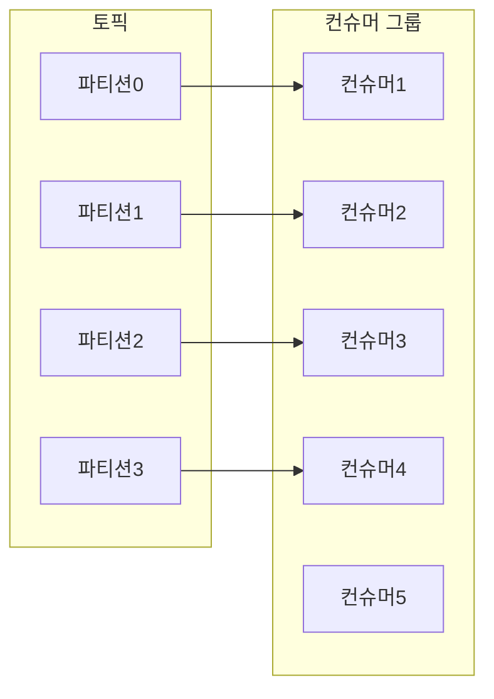

## 컨슈머와 컨슈머 그룹

- 여러 개의 컨슈머가 같은 토픽으로부터 메시지를 분할해서 읽어올 수 있다.
- 여러 개의 컨슈머는 동일한 컨슈머 그룹에 속할 수 있다. 
- 컨슈머 그룹이 동일한 토픽을 구독할 경우, 각각의 컨슈머는 해당 토픽의 서로 다른 파티션의 메시지를 받게 된다.
- 컨슈머 그룹에 파티션 수보다 많은 컨슈머가 추가되면, 일부 컨슈머는 유휴 상태가 되어 메시지를 받지 못한다. 

> 토픽 수 < 컨슈머 수

- 토픽을 생성할 때 파티션 수를 크게 주는게 오히려 낫다.

#### 중간 정리

- 1개 이상의 토픽을 구독하는 새로운 컨슈머 그룹을 만든다.
- 메시지를 처리율을 높이려면 컨슈머 그룹에 컨슈머를 추가해서 메시지를 여러 컨슈머가 받아가서 처리하도록 한다. 

## 파티션 리밸런싱

- 컨슈머에 할당된 파티션을 다른 컨슈머에게 할당해주거나, 토픽에 새 파티션이 추가되었을 때 파티션을 재할당하는 작업을 '리밸런스(rebalance)'라고 한다.
- 토픽의 리밸런스는 그룹 코디네이터와 컨슈머 그룹의 리더 간의 상호작용을 통해 이뤄진다.
	1. **그룹 코디네이터(Group Coordinator)**: Kafka 클러스터 내에 있는 브로커 중 하나가 이 역할을 한다. 이 코디네이터는 컨슈머 그룹의 멤버십과 파티션 할당을 관리한다.
	2. **컨슈머 그룹의 리더(Consumer Group Leader)**: 컨슈머 그룹 내의 컨슈머 중 하나가 리더로 선출된다. 이 리더는 그룹 내의 다른 컨슈머들에게 파티션을 할당하는 역할을 담당하며, 이 할당 정보를 그룹 코디네이터에게 보고한다.
- 리밸런싱 과정
	- 컨슈머 그룹에 새로운 컨슈머가 추가되거나 기존 컨슈머가 탈퇴할 때 리밸런싱이 시작
	- 그룹 코디네이터는 컨슈머 그룹의 리더를 선정하고, 리밸런싱 과정을 시작
	- 리더는 사용 가능한 파티션을 그룹 내의 컨슈머에게 할당하고, 이 할당 정보를 그룹 코디네이터에게 전달
	- 그룹 코디네이터는 이 정보를 바탕으로 각 컨슈머에게 최종 파티션 할당을 전달

### 조급한 리밸런스 (Eager Rebalance)

- 모든 컨슈머는 읽기 작업을 멈추고 자신에게 할당된 모든 파티션의 소유권을 포기한다.
- 모든 컨슈머는 컨슈머 그룹에 다시 참여하여 완전히 새로운 파티션을 할당 받는다.
- 이때 짧은 시간 동안 모든 읽기 작업이 멈추게 된다.
- (카프카 2.4 버전 이후 기본값으로 사용됨)

### 협력적 리밸런스 (Cooperative Rebalance) 또는 점진적 리밸런스 (Incremental Cooperative Rebalancing)

- 컨슈머 그룹에 새로운 컨슈머가 참여하면 컨슈머 그룹 리더가 일부 파티션을 재할당할 것이라고 해당 컨슈머에게 통보한다. 
- 해당 파티션에서 데이터를 읽는 컨슈머는 소유권을 포기한다.
- 컨슈머 그룹 리더는 이 파티션을 새로운 컨슈머에게 다시 새로 할당한다.
- (카프카 3.1 버전부터 기본값으로 사용됨)

#### ☝️ 컨슈머가 컨슈머 그룹 소속을 유지할 수 있는 방법

- 그룹 코디네이터(group coordinator)에게 Heartbeat를 전송함으로써 멤버쉽과 파티션에 대한 소유권을 유지

## 정적 그룹 멤버십

- 컨슈머 그룹 내에 고유한 `group.instance.id` 값을 지정하면, 이 컨슈머가 그룹에서 자동으로 빠지지 않고 멤버십을 그대로 유지할 수 있다. (리벨런스가 발생하지 않음)
- 애플리케이션이 각 컨슈머에 할당된 파티션의 내용물을 사용해서 로컬 상태나 캐시를 유지해야 할 때 편리 ?

## 컨슈머 생성

- `KafkaConsumer`인스턴스를 생성할 때 `bootstrap.servers`, `key.deserializer`, `value.deserializer` 속성은 필수
- 일반적으로 많이 사용되는 컨슈머 그룹을  지정하는 `group.id` 속성

## 토픽 구독

- 1개 이상의 토픽을 구독할 수 있다.
- `subscribe()` 메서드는 토픽 목록을 매개변수로 받는다.
- 정규 표현식으로 다수 토픽 이름이 매칭되도록 할 수 있다.
	- `consumer.subscribe(Pattern.compile("test.*"));`

## 폴링 루프

- 컨슈머의 핵심은 토픽에 메시지가 들어왔는지 폴링하는 단순한 무한 루프다. 
- `poll()` 메서드에 전달하는 매개변수는 ~~컨슈머 버퍼에 데이터가 없을 경우 `poll()`이 블록될 수 있는 최대 시간을 결정한다.~~
	- `poll()`을 호출한 후에 토픽에 메시지가 새로운 메시지가 없을 때 얼마동안 기다려야 하는지 밀리초
	- 0을 전달하면 `poll()`은 즉시 반환된다.
- 컨슈머는 최초 `poll()`메서드가 호출될 때 컨슈머 그룹에 참가하고, 파티션을 할당 받게 된다.
- `max.poll.interval.ms` 시간 동안 `poll()`이 호출되지 않을 경우 컨슈머 그룹에서 퇴출된다.
	- 따라서 폴링 루프 안에서 오랜 시간 블록되는 작업은 피해야 한다. 

## 컨슈머 설정

- ⚙️ _`fetch.min.bytes`_
	- 브로커로부터 레코드를 받아오는 데이터의 최소량(bytes)
	- 브로커는 레코드 양이 이 크기보다 적으면 메시지를 보내지 않고 기다린다.
	- 아래 `fetch.max.wait.ms`설정도 함께 관여된다. 
	- <u>브로커와 컨슈머가 주고 받는 메시지의 사이즈가 줄어들면 양쪽 모두 부하가 감소된다.</u>
- ⚙️ _`fetch.max.wait.ms`_
	- Fetch 요청에 대해 브로커가 얼마나 오래 레코드가 쌓일 때까지 기다릴 수 있는지
	- <u>`fetch.min.bytes`가 충족될 때까지 `fetch.max.wait.ms`만큼의 지연이 발생할 수 있다.</u>
- ⚙️ _`fetch.max.bytes`_
	- Fetch 요청에 브로커가 반환하는 최대 bytes 크기
	- 컨슈머가 브로커로부터 받은 데이터를 저장하기 위해 사용하는 메모리 양을 제한하기 위해 사용
	- 컨슈머의 메모리가 충분하다면 이 값을 늘려서 더 많은 데이터를 읽을 수 있도록 한다. 
- ⚙️ _`max.poll.records`_
	- `poll()`을 한번 호출했을 때 반환되는 최대 레코드 수
	- 폴링 루프에서 컨슈머 애플리케이션이 처리할 수 있는 양을 조절할 수 있다. 
	- <u>이 설정은 Fetch 동작에 영향을 주지 않는다. 컨슈머는 각 Fetch 요청에서 레코드를 캐시하고 있다가 각 `polling()`에서 점진적으로 레코드를 반환한다.</u>
	- 이 값이 작을수록 `poll()` 호출을 빠르게 할수 있기 때문에 리밸런스 작업도 빠르게 끝날 수 있다.
		- `max.poll.interval.ms` 시간 안에 `poll()` 요청을 보내야하기 때문에 메시지 처리 작업을 빠르게 끝내서 리밸런스가 될 가능성이 줄어든다. 
		- 레코드를 작게 
- ⚙️ _`max.partition.fetch.bytes`_
	- 파티션별로 리턴하는 최대 bytes 크기
	- 만약 가져오려는 데이터의 첫 번째 파티션에 있는 첫 번째 레코드 배치가 이 설정값보다 크더라도, Kafka 컨슈머가 데이터를 처리하고 진행할 수 있도록 이 레코드 배치는 그냥 전달된다.
		- 일반적으로 데이터 전송 크기를 제한하지만, 데이터 처리의 연속성을 위해 필요한 경우에는 이 제한을 초과하는 데이터도 가져올 수 있게 해준다.
	- 컨슈머 입장에서 브로커가 보낸 메시지에 얼마나 많은 파티션이 포함되어 있는지 알 수 없기 때문에 `fetch.max.bytes`를 사용하는 게 낫다.
- ⚙️ _`session.timeout.ms`_
	- 컨슈머가 하트비트를 보내지 않고, 컨슈머 그룹에서 소속될 수 있는 최대 시간
- ⚙️ _`heartbeat.interval.ms`_
	- 컨슈머가 그룹 코디네이터에게 얼마나 자주  하트비트를 보낼지 간격
	- `session.timeout.ms`보다 작아야 하며 보통 1/3
- ⚙️ _`max.poll.interval.ms`_
	- 컨슈머가 폴링하지 않고 있을 때 죽은 것으로 판단하지 않을 수 있는 최대 시간
	- 컨슈머가 메시지를 제대로 요청하고 있는지 확인
		- 레코드를 읽어오는 메인 스레드에는 데드락이 걸렸는데 백그라운드 스레드에서 멀쩡히 하트비트를 전송하고 있을 수 있다. 
	- 이 값은 매우 드물게 도달할 수 있도록 충분히 크게 잡는 것이 좋다. 
- ⚙️ _`request.timeout.ms`_
	- 컨슈머가 브로커로부터 응답을 기다릴 수 있는 최대 시간
- ⚙️ _`auto.offset.reset`_
	- 컨슈머가 예전에 오프셋을 커밋한 적이 없거나 오프셋이 유효하지 않을 때, <u>파티션을 읽기 시작할 때의 동작을 정의</u>
	- 기본값은 `latest` (컨슈머가 동작하기 시작한 다음부터 쓰여진 레코드), 다른값은 `earliest` (파티션의 맨 처음부터)
- ⚙️ _`enable.auto.commit`_
	- 컨슈머가 오프셋을 자동으로 커밋할지
	- 기본값 `true`
- ⚙️ _`partition.assignment.strategy`_
	- 파티션 할당(리밸런스) 전략을 지정 (1개 이상 지정 가능)
	- Eager Rebalance는 `range`, Cooperative Rebalance는 `cooperative-sticky`

## 오프셋과 커밋

- 오프셋 커밋(offset commit) : 파티션에서의 현재 위치를 업데이트하는 작업
- 카프카는 레코드를 개별적으로 커밋하지 않는다.
- 컨슈머는 파티션에서 처리한 마지막 메시지를 커밋함으로써 그 앞의 모든 메시지가 성공적으로 처리되었음을 암묵적으로 나타낸다. 

### 컨슈머가 오프셋을 커밋하는 방법은?

- 특수 토픽인 `__consumer_offsets` 토픽에 각 파티션별 커밋된 오프셋을 업데이트하는 메시지를 전송
- `poll()`이 반환한 마지막 오프셋에서 +1 더한 오프셋이 커밋된다.

### 자동 커밋

- `enable.auto.commit=true`인 경우, `auto.commit.interval.ms`의 기본값 5초 간격으로 `poll()`메서드를 실행할 때 자동으로 커밋한다. 
- 특정 컨슈머의 문제가 발생할 경우, 파티션이 리밸런스될 때 커밋된 오프셋의 시차에 따라 중복 처리가 발생할 수 있다.
	- 따라서 폴링 루프에서 예외 처리를 잘 해야 한다.

### 수동 커밋

- `enable.auto.commit=false`
- `commitSync()` 메서드를 호출하면 `poll()`이 반환한 마지막 오프셋을 커밋
- 모든 레코드가 처리되기 전에 `commitSync()`가 호출되지 않도록 주의해야 한다.
- 비동기로 수동 커밋을 하려면 `commitAsync()`메서드를 사용
	- 커밋이 실패하더라도 재시도 하지 않는다는 단점
	- 단, 브로커의 응답을 통해 콜백 함수를 호출할 수 있다.

## 리밸런스 리스너

- 컨슈머 API는 컨슈머에 파티션이 할당되거나 해제될 때 사용자 코드가 실행되도록 하는 메커니즘을 제공한다.

## 특정 오프셋의 레코드 읽어오기

- (예제 해보기)

## 폴링 루프를 벗어나는 방법

- `poll()`을 기다리는 동안 즉시 루프를 탈출하려면 다른 스레드에서 `consumer.wakeup()`을 호출한다.
- `WakeupException`이 발생하면 스레드를 종료하기 전에 `consumer.close()`를 호출해서 오프셋 커밋과 컨슈머 그룹에서 떠난다는 메시지를 전송하도록 챙긴다.
- (예제 해보기)

## 독립 실행 컨슈머(standalone consumer)

- 하나의 컨슈머가 토픽의 모든 파티션으로부터 모든 데이터를 읽어와야 하거나, 토픽의 특정 파티션으로부터 데이터를 읽어와야 할 때
- 컨슈머 그룹이나 리밸런스가 필요하지 않다. 

