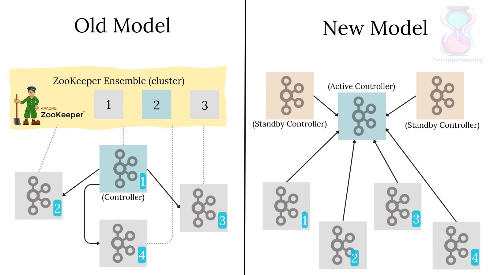
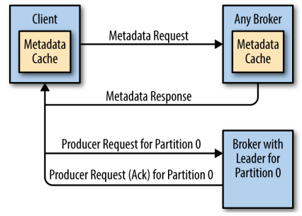

## 클러스터 멤버십
- 카프카 클러스터는 브로커 멤버들의 목록을 아파치 주키퍼에 저장한다.
- 각 브로커는 고유한 식별자를 가지며, 주키퍼에 Ephemeral(일시적인)) 노드의 형태로 ID를 등록한다.
- 주키퍼의 `/brokers/ids` 경로에 등록된 브로커 목록이 담겨있다.

## 컨트롤러
- 브로커 중에 **클러스터 메타데이터를 관리**하고, **파티션 리더를 선출하는 역할**을 맡는 브로커
- 클러스터 안에 **단 한 개의 컨트롤러**만 있을 수 있다. 
	- 서로 다른 브로커가 자신이 컨트롤러라 착각하는 상황을 방지하기 위해 에포크 번호(순번)를 사용한다.
	- 에포크 번호는 새로운 컨트롤러가 선출될 때마다 증가된 값이라서 이전 컨트롤러의 값이 새로운 컨트롤러의 값보다 낮기 때문에 구분할 수 있게 된다.

### KRaft - 새로운 방식의 컨트롤러
- 주키퍼 기반 컨트롤러에서 탈피해서 Raft 기반 컨트롤러 쿼럼으로 옮겨가자는 취지
- Raft 기반 컨트롤러(N) 쿼럼
	- 쿼럼(Quorum)이란 시스템 내에서 결정을 내리기 위해 필요한 최소한의 노드 수
	- Kafka 클러스터 내에서 (Raft 알고리즘을 사용하여) 중요한 의사결정을 내리는 데 필요한 컨트롤러 노드들의 집합을 의미
- Kraft 도입 후로 "브로커"라는 의미는 카프카 프로세스가 맡을 수 있는 _역할_ 을 의미하게 됐다.
	- Kraft 이전에 컨트롤러는 파티션 리더를 선출하는 특정 브로커를 나타냈다.
	- Kraft 이후부터 컨트롤러는 동적 메타데이터를 저장하는 카프카 프로세스이다. 
	- 정리하자면, **브로커는 메시지(레코드)를 저장하는 카프카 프로세스이며, 컨트롤러는 클러스터의 동적 메타데이터를 저장하는 카프카 프로세스이다.** 
- Kraft에는 다수의 컨트롤러 카프카 프로세스가 존재하며, 이 중 하나가 액티브 컨트롤러가 된다. 나머지 컨트롤러는 팔로우 컨트롤러로서 액티브 컨트롤러와 동일한 메타데이터를 유지하며 대기한다.
	- 컨트롤러 프로세스들은 Raft 알고리즘을 사용해서 외부 시스템(예: 주키퍼)에 의존하지 않고도 자체적으로 리더를 선출할 수 있다.
	- 아래 그림에서 좌측은 Kraft 이전에 컨트롤러가 다른 브로커에게 변경 사항을 Push 하는 방식이고, 우측은 Kraft 적용 후 다른 브로커가 변경 사항을 Pull 하는 방식을 보여준다.

	

#### 주키퍼에서 벗어나려나려는 이유
1. 컨트롤러와 주키퍼, 컨트롤러와 브로커 간의 통신은 동기적인 것과 비동기적인 것이 혼재하기 때문에 데이터 불일치가 발생할 수 있다.
2. 컨트롤러가 재시작할 때마다 주키퍼로 받은 모든 브로커와 파티션에 대한 메타데이터를 모든 브로커에 전송해야 한다. 파티션과 브로커의 수가 늘어날수록 컨트롤러 재시작은 느려진다.
3. 메타데이터의 소유권 관련 아키텍처가 좋지 못하다.
4. 주키퍼 자체에 대한 엔지니어의 관리 비용 증가

## 복제
- 토픽은 1개 이상의 파티션으로 분할되며, 각 파티션은 N개의 레플리카를 가질 수 있다. 
- 각 레플리카는 여러 브로커에 분산되어 저장된다.

### 리더 레플리카
- 파티션의 리더 역할
- 모든 쓰기 요청을 처리
- 각 팔로워 레플리카가 마지막으로 요청한 메시지의 오프셋을 확인해서 뒤쳐져 있지 않은지 확인
- <u>선호 리더(preferred leader)</u>는 파티션이 처음 생성될 때 리더였던 리더 레플리카를 가리킨다. 
	- 리더 레플리카는 모든 브로커에 균등 분포되기 때문에 '선호'라고 부르며, 선호 리더가 실제 리더가 될 경우 메시지 부하가 브로커들 사이에 균등 분배될 것이라 기대한다. 

### 팔로워 레플리카
- 리더 레플리카로부터 메시지를 복제하여 최신 상태를 유지
- (기본적으로) 클라이언트의 요청을 처리할 수 없다. (별도 설정 필요)
- 지속적으로 최신 메시지 복제를 요청하는 레플리카를 'In-Sync Replica(ISR)'이라고 한다.

## 요청 처리
- 카프카 브로커가 하는 일의 대부분은 클라이언트 요청, 파티션 레플리카 요청, 컨트롤러가 파티션 리더에게 보내는 요청을 처리하는 것이다.

### 쓰기 요청
- 카프카 클라이언트는 아무 브로커에 메타데이터를 요청한 후 메타데이터를 캐시했다가 각 파티션의 리더 정보를 통해 쓰기&읽기 요청을 보낸다. (아래 이미지 참고)
	

### 읽기 요청
- 클라이언트가 읽기 요청을 보내면 파티션 리더만이 처리한다. 지정한 오프셋부터 요청한 크기 한도만큼 메시지를 반환한다. 
- 카프카가 빠른 이유는 클라이언트에게 보내는 메시지에 **Zero-Copy** 최적화가 적용되어 있기 때문이다. 
- 클라이언트는 브로커가 반환할 데이터의 하한(최소) 사이즈를([[카프카 핵심 가이드 스터디 - 카프카 컨슈머#^f9713a|fetch.min.bytes]]) 지정함으로써 데이터를 주고 받는 횟수를 줄일 수 있다.
- 하한 사이즈와 더불어 브로커에게 타임아웃을 함께 지정할 수 있다. ([[카프카 핵심 가이드 스터디 - 카프카 컨슈머#^8186cd|fetch.max.wait.ms]])
- 카프카는 클라이언트가 모든 In-Sync Replica에 존재하는 **High Watermark** 메시지만 받을 수 있도록 보장한다.

#### High Watermark
> 모든 ISR에 성공적으로 복제된 마지막 메시지의 오프셋

## 저장소
### 계층화된 저장소 (Tiered Storage)
- 대량의 데이터를 장기간 저장하기 위한 목적
- 카프카 클러스터의 저장소를 로컬과 원격, 두 계층으로 나눈다.
- 로컬 계층은 브로커의 로컬 디스크를 사용
- 원격 계층은 HDFS나 S3 같은 저장소 시스템을 사용
- 로컬 계층의 저장소가 로컬 계층보다 비싸기 때문에 로컬 계층의 보존 기간을 (몇 시간 이하로) 더 짧게 설정한다.
- 로컬 계층에 저장되는 데이터 양이 줄어들어 복구 및 리밸런싱 과정이 간소해진다.
	

### 파티션 할당
- 각 파티션의 레플리카는 서로 다른 브로커에 배치된다.
- 새 파티션을 저장할 브로커를 선택할 때는 각 브로커의 저장된 파티션의 수를 센 뒤, 가장 적은 파티션이 저장된 브로커에 새 파티션을 저장한다. 

### 파일 형식과 관리
- 토픽마다 보존 기간(Retention Period)을 설정할 수 있다.
- 하나의 파티션은 **여러 개의 세그먼트로 분할**된다.
- **세그먼트는 하나의 데이터 파일 형태**로 저장된다. 
- 세그먼트에 저장되는 데이터는 카프카 메시지와 오프셋이 저장되어 있으며, 프로듀서에서 브로커로, 브로커에서 컨슈머로 보내지는 형태가 같기 때문에 제로카피 최적화를 할 수 있다.
- 각 세그먼트는 1GB 또는 최근 1주일치 데이터 중 적은 쪽만큼만 저장할 수 있다.
- 세그먼트 한도가 다 차면 세그먼트를 닫고, 새로운 세그먼트를 생성한다.
- 현재 쓰여지고 있는 세그먼트를 **액티브 세그먼트**라 하며, **세그먼트가 닫히기 전까지는 어떠한 경우에도 데이터를 삭제할 수 없다.**
	- 예를 들어 로그 보존 기간을 1일로 설정했지만, 각 세그먼트가 5일치 데이터를 저장하고 있을 경우 실제로 5일치 데이터가 보존된다.
- 

### 인덱스
- 임의의 오프셋부터 메시지를 읽어올 수 있다.
- 오프셋이 저장된 위치를 빠르게 찾기 위해서 오프셋과 세그먼트 파일 및 그 안에서의 위치를 매핑한 인덱스1를 가지고 있다.
- 타임스탬프와 메시지 오프셋을 매핑하는 인덱스2도 있다. 카프카 스트림즈는 타임스템프를 기준으로 메시지를 광범위하게 검색할 때 유용하다.

### 압착
- 삭제(delete) 보존 정책은 지정된 보존 기한보다 더 오래 된 이벤트를 삭제
- 압착(compact) 보존 정책은 토픽에서 각 키의 가장 최근값만 저장
	- 키 값이 null인 메시지는 압착을 할 수 없다.
- 삭제 + 압착 보존 정책을 동시에 적용할 수도 있다. 
- 압착 보존된 가장 최근 메시지조차 완전히 삭제하려면, 해당 키와 null (value)값을 갖는 메시지를 저장하면 된다. 
	- 이같은 메시지를 툼스톤 메시지라고 하며, 컨슈머가 이 메시지를 읽을 경우 데이터가 삭제된 것을 감지할 수 있어야 한다. 
- 엑티브 세그먼트는 압착하지 않는다.

## 읽을거리
- [Tiered Storage](https://medium.com/spitha-techblog/tiered-storage-ac094eab500c)
- [Tiered Storage - Video](https://developer.confluent.io/courses/architecture/tiered-storage/)

