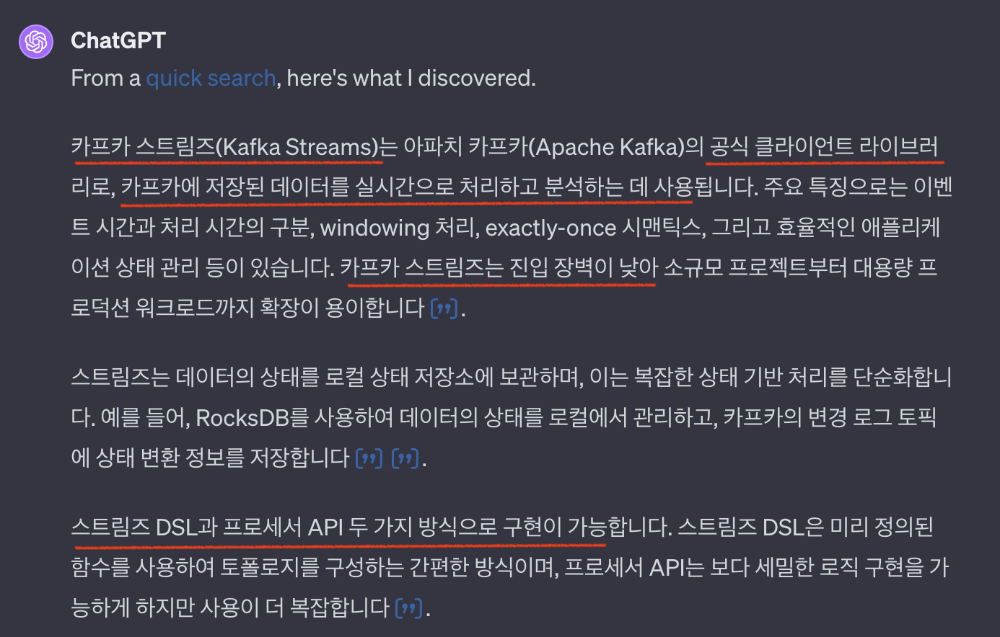

Chapter8. '정확히 한 번' 의미 구조
---

# 시작하며
'최소 한 번' 전달은 메시지 중복의 가능성이 있다.
'정확히 한 번' 의미 구조(EOS, Exactly-Once Semantics)는 두 가지 핵심 기능의 조합으로 이루어진다.

1. 멱등적 프로듀서 (Idempotent Producer)
2. 트랜잭션 의미 구조 (Transaction)

# 멱등적 프로듀서

> [!NOTE] 멱등성 (Idempotent)
> 연산을 여러 번 적용하더라도 결과가 달라지지 않는 성질.
> 동일한 작업을 여러 번 실행해도 한 번 실행한 것과 결과가 같음.

> 지금까지의 '최소 한 번'의 구조를 가진 프로듀서는 메시지 전송을 재시도 할 때 중복이 발생할 수도 있다.
 


### 멱등적 프로듀서의 작동 원리
- 멱등적 프로듀서 기능을 켜면 **모든 메시지**는 **고유한 프로듀서 ID (PID)** 와 순차적으로 증가하는 **시퀀스 넘버**를 갖게 된다. 여기에 **토픽**과 **파티션**을 조합하면 각 메시지의 고유한 식별자가 될 수 있다.
	

- 각 브로커에 할당된 모든 파티션에 쓰여진 **마지막 5개 메시지를 추적**하기 위해 이 식별자를 사용한다.  
	- 파티션별로 추적되어야 하는 시퀀스 넘버의 수를 변경하려면 `max.in.flight.requests.per.connection=5` 설정을 수정한다. 
	- <u>이 설정은 기본적으로 프로듀서가 브로커의 파티션마다 병렬로 요청할 수 있는 메시지 요청의 수를 제어한다.</u>
	- 만약 재시도 횟수를 높게 설정할 경우 순서를 보장하기 위해 이 값을 1로 설정할 수 있지만, 처리량이 낮아진다. 


### 멱등적 프로듀서가 겪을 수 있는 상황
#### 브로커가 중복 메시지를 받을 경우
- 적절한 에러를 발생시켜 중복 메시지를 거부한다.
- 이 에러는 프로듀서에 로깅 되지만 예외가 발생하는 건 아니다.
- 프로듀서의 `record-error-rate`지표와 브로커의 `ErrorPerSec` 지표에 반영된다. 

#### 멱등적 프로듀서가 재시작될 경우
- 멱등적 프로듀서는 초기화 과정에서 브로커로부터 프로듀서 ID를 받는다.
- 프로듀서에 장애가 발생해서 새로운 프로듀서를 실행했다면, ⚠️ <u>프로듀서 ID가 서로 다르기 때문에</u> 중복 메시지를 보내더라도 브로커가 알 수 없다.

#### 브로커에 장애가 난 경우
- (가정) 브로커 A에 리더 레플리카,  브로커 B에 팔로워 레플리카가 있다고 가정했을 때, 브로커 A가 장애가 나서 브로커 B가 새로운 리더가 되었다.
	1. 리더 레플리카는 새 메시지가 쓰여질 때마다 인-메모리 프로듀서 상태에 최근 5개의 시퀀스 넘버러를 업데이트 한다.
	2. 팔로워 레플리카는 리더로부터 메시지를 복제할 때 자체적인 인-메모리 프로듀서 상태를 업데이트 한다.
	3. 팔로워가 리더가 된 시점에 이미 메모리 안에 최근 5개의 시퀀스 넘버가 존재하게 된다.
	4. 또한 브로커는 종료될 때, 새 세그먼트가 생성될 때 프로듀서 상태를 스냅샷 파일로 저장한다. 브로커가 복구 될 때 오래된 스냅샷뿐만 아니라 최신 세그먼트 메시지까지 사용해서 복구된다.

### 멱등적 프로듀서의 한계
- 멱등적 프로듀서는 내부 로직으로 인한 재시도가 발생할 경우에 생기는 중복만 방지한다.
- 즉, 동일한 메시지를 두 번 `send()`하게 되면 중복 메시지가 생기게 된다. 

### ⭐️ 멱등적 프로듀서 사용방법
- **`enable.idempotence=true`** 설정만 추가하면 된다.
	- 카프카 3.0 부터는 기본값❓ : 브로커 설정으로 될 문제인가?
	- `librdkafka` 라이브러리에서 이 설정의 기본값은 `false` 이다.  이 값을 `true`로 변경하면 아래 나열된 값도 자동 조정된다. 
		- `max.in.flight.requests.per.connection=5` : 반드시 5보다 작거나 같아야 함
		- `retries=INT32_MAX` : 반드시 0보다 커야 함
		- `acks=all`
		- `queuing.strategy=fifo` : <u>EXPERIMENTAL</u>, <u>DEPRECATED</u>


# 트랜잭션
트랜잭션 기능은 [카프카 스트림즈(Kafka Streams)](https://docs.confluent.io/platform/current/streams/overview.html)를 사용해서 메시지 스트리밍 처리 시 데이터의 일관성과 정확성을 보장하기 위해 도입되었다.
즉,  **스트림 처리** 애플리케이션을 위한 '**읽기-처리-쓰기**' 패턴에서 사용될 수 있다.

스트림 처리 애플리케이션이 개별 레코드 변환과 필터링만 수행한다면 단순하겠지만, **다수 레코드를 집적해서 하나로 만드는 작업** 같은 경우에서는 '**정확히 한 번**' 기능으로 정확한 집적 결과를 보장해야 한다.

트랜잭션은 대부분 프로듀서쪽 기능이다. 



### 트랜잭션이 필요한 상황

> (가정) 원본 토픽으로부터 레코드를 가져와서 처리한 다음 결과를 다른 토픽에 쓰고, 읽어 온 메시지의 오프셋을 커밋하는 상황

- 컨슈머가 결과 토픽에는 썼지만 메시지의 오프셋을 커밋하지 못하고 크래시가 날 경우
	- 컨슈머 리밸런싱이 일어나고 <u>커밋되지 않은 오프셋은 다른 컨슈머에서 재처리되어 중복 처리가 발생</u>할 수 있다.
- 레코드 배치(`poll()`)를 읽어온 후 동작을 멈추거나 카프카와 연결이 끊어져서 하트비트를 전송하지 못할 경우 
	- 컨슈머 리밸런싱이 일어나고 <u>죽었던 컨슈머가 스스로 자신의 상태를 알지 못하고 다시 동작을 이어서 수행한다면 중복 처리가 발생</u>할 수 있다. (좀비 컨슈머)

### 트랜잭션이 '정확히 한 번'을 보장하는 방법
- '정확히 한 번' 처리라는 것은 읽기-처리-쓰기 작업이 원자적으로(atomic) 이루어진다는 것이다.
- 카프카 트랜잭션은 **원자적 다수 파티션 쓰기(atomic multipartition write)** 기능을 사용한다.

#### 프로듀서에서 트랜잭션을 사용하기
- 트랜잭션을 사용하는 프로듀서는 `transactional.id` 설정이 잡혀있고, `initTransactions()`를 호출해서 초기화 한다.
- `transactional.id`는 프로듀서 설정의 일부이며, 재시작 하더라도 값이 유지된다. 
	(재시작 후에도 동일한 프로듀서를 식별하기 위함)
- `transactional.id`와 프로듀서 ID는 서로 1:1 대응 관계를 유지하고 있다.
- 이미 존재하는 `transactional.id`로 `initTransactions()`를 호출하면 기존에 쓰던 프로듀서 ID를 다시 할당한다.

#### 중복 (좀비) 프로듀서를 방지하는 방법
- 프로듀서가 `initTransactions()`를 호출하면 `transaction.id`에 해당하는 Epoch 값을 증가 시켜서 Epoch 값이 낮은 프로듀서의 요청을 거부한다. 
- 즉, 좀비 프로듀서가 중복 레코드를 쓰는 것은 불가능하다.

### 컨슈머의 격리 수준
- `isolation.level`설정값으로 트랜잭션 기능을 써서 쓰여진 메시지들을 읽어오는 방식을 제어할 수 있다.
- **`read_committed`** 
	- `poll()`을 호출 했을 때 트랜잭션에 커밋된 메시지와 처음부터 트랜잭션에 속하지 않은 메시지만 반환한다. 
	- 아직 진행중인 트랜잭션이 처음으로 시작된 시점(Last Stable Offset, LSO) 이후 쓰여진 메시지는 반환되지 않는다. 
		- 트랜잭션이 커밋되거나 중단될 때, 또는 `transaction.timeout.ms` 설정값을 초과하여 브로커가 트랜잭션을 중단할 때까지 보류된다. 
- **`read_uncommitted`**
	- 진행중이거나 중단된 트랜잭션에 속한 모든 메시지가 반환된다. 


### 트랜잭션으로 해결할 수 없는 문제들
1. **스트림 처리에서의 부수 효과**
	- 카프카의 '정확히 한 번' 처리는 카프카 프로듀서 내부의 메시지 전송 과정에만 적용된다.
	- 예를 들어, 스트림 처리 중에 이메일을 보내는 작업은 이 기능의 보호를 받지 못한다. 
	- 즉, 카프카에서 메시지가 중복되지 않아도, 이메일 같은 외부 작업은 중복될 수 있다. (내 탓 아님)
    
2. **카프카 토픽에서 읽어서 데이터베이스에 쓰는 경우**:
	- 카프카에서 데이터를 읽고 외부 데이터베이스에 쓸 때, 카프카의 트랜잭션 기능은 적용되지 않는다. 
	- 카프카는 메시지 전송에만 '정확히 한 번' 처리를 보장하고, 데이터베이스 쓰기 작업에는 그런 보장이 없다.
    
3. **데이터베이스에서 읽어서 카프카에 쓰고, 다시 다른 데이터베이스에 쓰는 경우**
	- 이 경우도 카프카의 트랜잭션 기능은 전체 과정에 대한 보장을 제공하지 않는다. 
	- 카프카는 자체적인 메시지 전송에 대해서만 처리를 보장할 뿐, 다른 시스템과의 연동에서 발생하는 복잡한 트랜잭션 상황을 처리할 수 없다.
    
4. **한 클러스터에서 다른 클러스터로 데이터 복제**
	- 카프카 클러스터 간 데이터를 복제할 때 '정확히 한 번' 처리가 가능할 수도 있지만, 이것이 전체 트랜잭션의 원자성을 보장하지는 않는다. 
	- 즉, 한 클러스터에서 다른 클러스터로 데이터를 옮기는 과정에서 일부 데이터가 유실되거나 중복될 수 있다.
    
5. **발행/구독 패턴**
	- 이 패턴에서는 카프카가 일부 보장을 제공하지만, 이것이 완전한 '정확히 한 번' 처리는 아닙니다. 컨슈머가 메시지를 중복으로 처리할 수 있는 가능성이 여전히 존재한다.

### ⭐️ 트랜잭션 사용 방법

> 출처: https://github.com/confluentinc/confluent-kafka-python/blob/master/examples/eos-transactions.py

```python
def main(args):
    brokers = args.brokers
    group_id = args.group_id
    input_topic = args.input_topic
    input_partition = args.input_partition
    output_topic = args.output_topic

    consumer = Consumer({
        'bootstrap.servers': brokers,
        'group.id': group_id,
        'auto.offset.reset': 'earliest',
        # Do not advance committed offsets outside of the transaction.
        # Consumer offsets are committed along with the transaction
        # using the producer's send_offsets_to_transaction() API.
        'enable.auto.commit': False,  # 1️⃣
        'enable.partition.eof': True,  # 2️⃣
    })

    # Prior to KIP-447 being supported each input partition requires
    # its own transactional producer, so in this example we use
    # assign() to a single partition rather than subscribe().
    # A more complex alternative is to dynamically create a producer per
    # partition in subscribe's rebalance callback.
    consumer.assign([TopicPartition(input_topic, input_partition)])  # 3️⃣

    producer = Producer({
        'bootstrap.servers': brokers,
        'transactional.id': 'eos-transactions.py'  # 4️⃣
    })

    # Initialize producer transaction.
    producer.init_transactions()  # 5️⃣
    # Start producer transaction.
    producer.begin_transaction()  # 6️⃣

    eof = {}  # 7️⃣
    msg_cnt = 0
    print("=== Starting Consume-Transform-Process loop ===")
    while True:
        # serve delivery reports from previous produce()s
        producer.poll(0)

        # read message from input_topic
        msg = consumer.poll(timeout=1.0)
        if msg is None:
            continue

        topic, partition = msg.topic(), msg.partition()
        if msg.error():
            if msg.error().code() == KafkaError._PARTITION_EOF:
                eof[(topic, partition)] = True
                print("=== Reached the end of {} [{}] at {}====".format(
                    topic, partition, msg.offset()))

                if len(eof) == len(consumer.assignment()):
                    print("=== Reached end of input ===")
                    break
            continue
        # clear EOF if a new message has been received
        eof.pop((topic, partition), None)

        msg_cnt += 1

        # process message
        processed_key, processed_value = process_input(msg)  # 8️⃣

        # produce transformed message to output topic
        producer.produce(output_topic, processed_value, processed_key,
                         on_delivery=delivery_report)  # 9️⃣

        if msg_cnt % 100 == 0:
            print("=== Committing transaction with {} messages at input offset {} ===".format(
                msg_cnt, msg.offset()))
            # Send the consumer's position to transaction to commit
            # them along with the transaction, committing both
            # input and outputs in the same transaction is what provides EOS.
            producer.send_offsets_to_transaction(  # 1️⃣0️⃣
                consumer.position(consumer.assignment()),
                consumer.consumer_group_metadata())

            # Commit the transaction
            producer.commit_transaction()  # 1️⃣1️⃣

            # Begin new transaction
            producer.begin_transaction()  # 1️⃣2️⃣
            msg_cnt = 0

    print("=== Committing final transaction with {} messages ===".format(msg_cnt))
    # commit processed message offsets to the transaction
    producer.send_offsets_to_transaction(
        consumer.position(consumer.assignment()),
        consumer.consumer_group_metadata())

    # commit transaction
    producer.commit_transaction()

    consumer.close()
```

- 1️⃣ 트랜잭션의 일부가 되는 컨슈머는 인풋 토픽 오프셋을 직접 커밋하지 않고, 트랜잭션 작업 도중에 오프셋을 커밋해줘야 한다. 따라서 **자동 커밋 기능은 꺼야 한다.**
- 2️⃣ (예제 테스트 전용) 컨슈머가 파티션의 끝에 도달할 때마다 `RD_KAFKA_RESP_ERR__PARTITION_EOF` 이벤트를 발생시킨다. 
- 3️⃣ [KIP-447](https://cwiki.apache.org/confluence/display/KAFKA/KIP-447%3A+Producer+scalability+for+exactly+once+semantics) 지원되기 전에는 트랜잭션 펜싱 메커니즘이 동일한 파티션에 대해 동일한 트랜잭션 ID값에 의존했기 때문에 정적으로 트랜잭션 ID를 할당했다. (그래서 여기서는 `assign()`을 사용함) 
	- KIP-447 이후 `subscribe()` 호출을 통해 트랜잭션에 컨슈머 그룹 정보를 추가하고 이를 사용해서 좀비 펜싱을 수행한다. 
- 4️⃣ `transactional.id`를 설정해서 트랜잭션적 프로듀서를 생성한다.
- 5️⃣ 트랜잭션적 프로듀서 초기화, 트랜잭션 코디네이터 역할을 맡은 브로커에 트랜잭선 ID를 등록하고, 에포크 값을 증가 시킨다.
- 6️⃣ API 호출은 없고, 단순히 프로듀서에 현재 진행중인 트랜잭션이 있음을 알려 줄 뿐이다.
- 7️⃣ 이 예제 테스트에 한해 토픽의 모든 메시지가 처리 되었을 때 프로듀서를 종료 시킨다. 
- 8️⃣ 읽어온 메시지를 처리한다. 
- 9️⃣ 결과 토픽에 메시지를 전송한다.
- 1️⃣0️⃣ 트랜잭션 작업 도중에 인풋(읽기) 토픽 오프셋을 커밋한다. 메시지 처리가 실패하여 결과 토픽에 전송하지 못 했을 때 인풋 토픽의 오프셋이 커밋되지 않도록 보장한다.
- 1️⃣1️⃣ 오프셋 커밋 후 트랜잭션을 커밋한다.
- 1️⃣2️⃣ 다음 트랜잭션을 시작한다.


### 트랜잭션 ID와 펜싱
- 트랜잭션 ID는 동일한 애플리케이션이 재시작 되었을 때 일관적으로 유지되어야 하며, 서로 다른 애플리케이션끼리는 달라야 한다.
- 카프카 2.5 전까지는 펜싱을 보장하기 위해 트랜잭션 ID와 파티션을 정적으로 대응시켜서 항상 각 파티션이 단 하나의 트랜잭션 ID에 의해 읽혀짐을 보장했다.
	- 하지만 이 프로듀서가 좀비가 되면 새로운 프로듀서는 트랜잭션 ID가 다르기 때문에 좀비 프로듀서가 다시 살아나도 펜싱할 수 없게 된다. 
- 카프카 2.5에서 소개된 KIP-447에서 펜싱을 수행하는 방법으로 트랜잭션 ID와 컨슈머 그룹 메타데이터를 함께 사용하는 방식이 도입되었다.
	- 프로듀서는 오프셋 커밋 메서드를 호출할 때(`send_offsets_to_transaction()`) 컨슈머 그룹 메타데이터를 인수로 전달한다.
	- 위 경우와 다르게 새로운 프로듀서로부터의 트랜잭션은 좀비가 된 프로듀서보다 새로운 세대의 컨슈머 그룹에서 온 것이 명확하므로, 좀비 프로듀서는 펜싱된다. 


### 트랜잭션 작동 원리
- 카프카 트랜잭션 기능은 Chandy-Lamport Snapshot Algorithm의 영향을 받았다.
- 이 알고리즘은 통신 채널을 통해 '마커(marker)'라 불리는 컨트롤 메시지를 보내고, 이 마커의 도착을 기준으로 일관적인 상태를 결정한다.
- 프로듀서가 트랜잭션이 커밋하기 위해 트랜잭션 코디네이터에 '커밋' 메시지를 보내면, 트랜잭션 코디네이터가 트랜잭션과 관련된 모든 파티션에 커밋 마커를 쓴다.


### 트랜잭션 성능
- 트랜잭션은 프로듀서에 약간의 오버헤드를 발생시킨다.
- 트랜잭션 초기화와 커밋 요청은 동기적으로 작동하기 때문이다.
- 트랜잭션의 오버헤드는 트랜잭션에 포함된 메시지 수와는 무관하다. 따라서 트랜잭션마다 많은 수의 메시지를 집어넣는 것이 상대적으로 오버헤드가 적다. 
- 결과 토픽을 구독하는 컨슈머도 `read_committed` 모드일 때 아직 완료되지 않은 트랜잭션 메시지가 반환되지 않기 때문에 기다려야 할 수도 있다. 

